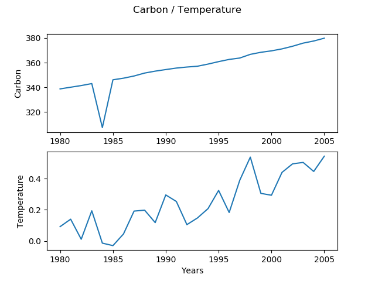

# Carbon_Temperature_Interpreter

## How can you use this program?
> Make sure to have python 3 and after that just run this piece of code
```
python3 main.py
```

By utilizing the Co2 and Temperature html page, we can parse it and then turn it into an interactive console experience for the user.


